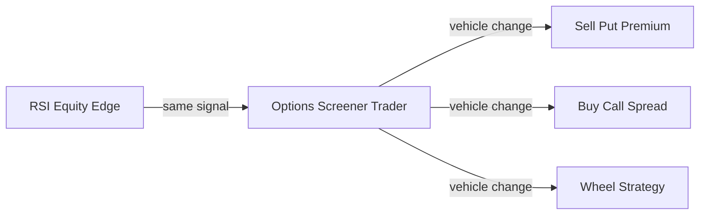

# 1. Introduction and Goals

## 1.1 What We Are Building

**Options Screener Trader** is a daily-automated, self-improving options trading system
built on top of the RSI equity screener's proven edge — _deeply oversold stocks with
volume confirmation tend to revert_ — and expresses that edge through premium-collection
options strategies rather than direct equity positions.

The system operates against an **Alpaca Paper trading account** (options-enabled) covering
the **S&P 500 and NASDAQ 100** universes.

---

## 1.2 Goals

| # | Goal |
|---|------|
| G1 | Accumulate ≥ 252 days of IV history per ticker before placing live orders |
| G2 | Achieve annualised premium yield > 15% on deployed capital |
| G3 | Win rate (puts expire worthless or closed at 50% profit target) > 65% |
| G4 | Keep assignment rate < 20% of CSPs opened |
| G5 | Self-optimise entry thresholds (IV rank, delta, DTE) from trade outcomes |
| G6 | Never deploy real capital — paper trading only in current scope |

---

## 1.3 Stakeholders

| Stakeholder | Role | Concern |
|-------------|------|---------|
| Hilary (owner/trader) | Sole user and decision maker | P&L, risk control, strategy correctness |
| Alpaca Paper API | Broker / execution venue | Order acceptance, position data accuracy |
| RSI Screener subsystem | Signal source | Correct regime and RSI signals fed to options layer |

---

## 1.4 Top Quality Goals

| Priority | Quality Goal | Scenario |
|----------|-------------|---------|
| 1 | **Safety** | No position exceeds 10% NAV; bear regime = no new trades |
| 2 | **Observability** | Every decision (screen, entry, exit) is logged with full reasoning |
| 3 | **Self-improvement** | Parameters tighten as trade history grows — system gets smarter |
| 4 | **Resilience** | API failures produce warnings, not crashes; state survives restarts |
| 5 | **Simplicity** | Each module does one thing; reuse screener_trader components where possible |
