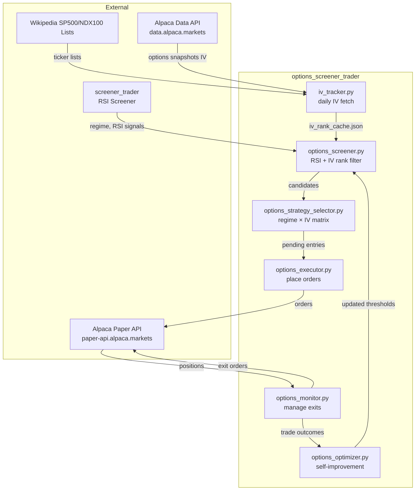

# 3. Context and Scope

## 3.1 System Context

## 3.2 What Is In Scope

| In Scope | Description |
|----------|-------------|
| IV history accumulation | Daily fetch of ATM IV for all universe tickers |
| IV Rank computation | Self-computed rolling 252-day rank |
| Options candidate screening | RSI + volume + IV Rank filter |
| Strategy selection | Regime × IV matrix → CSP / call spread / put spread |
| Paper order execution | Alpaca paper account orders |
| Position monitoring | 50% profit, 21 DTE, RSI recovery, loss limit exits |
| Self-optimisation | Parameter learning from trade outcomes |
| Wheel strategy | Assignment → covered call continuation |
| Earnings tracking | Flag tickers near earnings; include in signal data |

## 3.3 What Is Out of Scope

| Out of Scope | Reason |
|--------------|--------|
| Live / real-money trading | Paper only until strategy is validated |
| OPRA / Webull feed integration | Phase 2 consideration — Alpaca sufficient for IV |
| Russell 2000 universe | Review after 6 months (richer premiums, wider spreads) |
| Options Greeks beyond delta/IV | Delta used for strike selection; vega/theta informational only |
| Intraday monitoring | Daily cadence sufficient for the theta-decay strategy |

## 3.4 Interfaces to screener_trader

| Component | Usage |
|-----------|-------|
| `rsi_loop/regime_detector.py` | Imported directly — shared market regime classification |
| `screener_config.json` universe | S&P 500 ticker list source |
| `rsi_loop/signal_analyzer.py` | Pattern reference for `options_signal_analyzer.py` |
| `rsi_loop/optimizer.py` | Pattern reference for `options_optimizer.py` |
