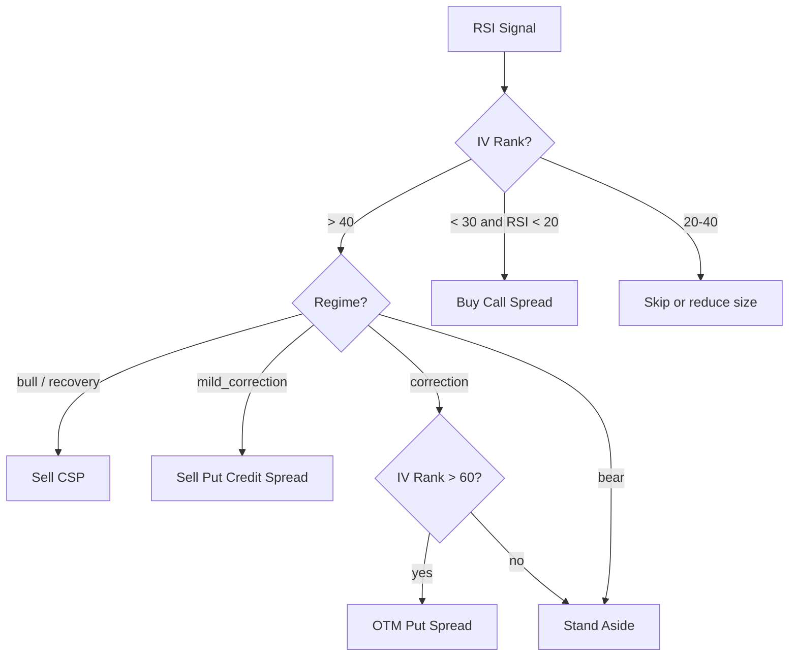
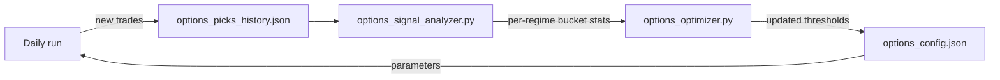

# 4. Solution Strategy

## 4.1 Core Idea

Reuse the equity screener's proven RSI mean-reversion edge, change only the instrument.
Instead of buying shares and waiting for recovery, **sell put premium** at a strike we'd
accept assignment at. Premium is collected upfront; theta decay works in our favour every day.

## 4.2 Strategy Selection Matrix

The system chooses a strategy based on two dimensions: **market regime** (from the shared
regime detector) and **IV Rank** (self-computed from iv_tracker).

| Regime | IV Rank | RSI | Strategy | Notes |
|--------|---------|-----|----------|-------|
| bull | > 40 | < 25 | Sell CSP | Core strategy |
| bull | > 40 | < 20 | Sell CSP (wider strike) | More OTM for safety |
| bull | < 30 | < 20 | Buy call debit spread | IV too cheap to sell |
| mild_correction | > 50 | < 25 | Sell put credit spread | Cap downside risk |
| mild_correction | > 50 | < 20 | Sell CSP (smaller size) | High conviction only |
| correction | > 60 | < 20 | Sell OTM put spread | Very selective |
| correction | < 60 | Any | Skip | Risk not worth it |
| bear | Any | Any | Skip | Stand aside entirely |
| recovery | > 40 | < 30 | Sell CSP (normal size) | Regime turning |

## 4.3 Exit Strategy

All exits run daily in `options_monitor.py` before market close (15:45 ET).

| Rule | Trigger | Action |
|------|---------|--------|
| 50% profit | Option value = 50% of premium received | Buy to close |
| 21 DTE | Days to expiry reaches 21 | Buy to close (gamma risk) |
| RSI recovery | Underlying RSI crosses above 50 | Buy to close (signal gone) |
| Loss limit | Position loss = 2× premium received | Buy to close |
| Assignment | Price < strike at expiry | Accept shares → sell covered call (Wheel) |

## 4.4 Self-Improvement Loop

The optimizer learns:
- Which IV Rank bucket produces the best annualised premium yield
- Which delta target maximises win rate per regime
- Whether 40% or 60% profit exit outperforms the 50% default
- Which strategy wins in each regime over time

## 4.5 Phased Build

| Phase | Scope | Gate |
|-------|-------|------|
| 1 — Foundation | IV history accumulation, screener (research mode, no orders) | 30+ days IV per ticker |
| 2 — Execution | Strategy selector, executor, monitor, positions state | Backtest validates strategy matrix |
| 3 — Self-improvement | Signal analyser, optimizer wired into daily run | 50+ closed trades with outcomes |
| 4 — Wheel automation | Auto-detect assignment, auto-generate CC pending entry | Phase 2 stable for 2+ months |
