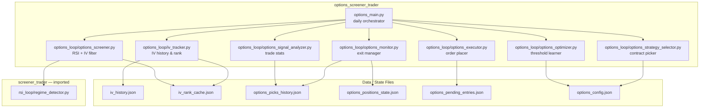

# 5. Building Block View

## 5.1 Level 1 — Top-Level Decomposition



## 5.2 Module Responsibilities

### `options_main.py` — Orchestrator
Entry point for the daily scheduled task. Calls each pipeline step in sequence.
Phase 1: calls `iv_tracker` then `options_screener` (research mode). Phase 2+ steps are commented placeholders.

### `iv_backfill.py` — Historical IV Bootstrap ✅ (Phase 1 — Live)
| Responsibility | Detail |
|----------------|--------|
| First-run detection | Triggered automatically when `iv_history.json` absent or < 5 symbols |
| Historical equity bars | Fetches ~270 calendar days of daily closes per symbol |
| Contract map | Constructs historically-appropriate ATM call symbol per (symbol, date) |
| Options bar fetch | Batch-fetches Alpaca historical options bars (35 symbols/call) |
| Black-Scholes IV | Newton-Raphson inversion of BS call price for each bar's mid price |
| History merge | Merges computed IV into `iv_history.json`; incremental by default |

### `iv_tracker.py` — IV History Builder ✅ (Phase 1 — Live)
| Responsibility | Detail |
|----------------|--------|
| Universe fetch | Downloads S&P 500 (Wikipedia) + NASDAQ 100 ticker lists |
| Stock price fetch | Alpaca latest trade for each ticker |
| Contract construction | Builds ATM call symbols directly — no contracts API call |
| IV snapshot fetch | Batch requests to Alpaca options snapshots endpoint |
| ATM IV selection | Picks the contract nearest to current stock price |
| History append | Appends today's IV to `iv_history.json` |
| IV Rank compute | Rolling 252-day window → `iv_rank_cache.json` |
| Earnings flag | Marks tickers near earnings in cache |

**Key data flow:**
```
Wikipedia lists → ticker universe (529 symbols)
    → Alpaca latest trades → stock prices
    → Direct symbol construction → ATM contracts
    → Alpaca options snapshots → impliedVolatility (top-level field)
    → iv_history.json → iv_rank_cache.json
```

### `options_screener.py` — Research Screener ✅ (Phase 1 — Live)
| Responsibility | Detail |
|----------------|--------|
| Regime detection | Reads `screener_trader/market_regime.json` if fresh; else computes from SPY/VIXY bars |
| Signal fetch | Batch equity bars → Wilder RSI(14) + volume ratio per eligible symbol |
| Strategy matrix | Pure function: `(rsi, vol_ratio, iv_rank, regime)` → strategy type |
| Candidate output | Writes `options_candidates.json` (overwritten each run) |
| Research corpus | Appends new picks to `options_picks_history.json` with `research_mode: true, phase: 1` |

**No orders are placed.** Every pick carries `outcome_tracked: false` — Phase 3 fills this in.

### `options_strategy_selector.py` — Contract Picker _(Phase 2)_

### `options_strategy_selector.py` — Contract Picker _(Phase 2)_
Reads candidates from options_screener, IV Rank from iv_rank_cache, regime from cache.
Applies DTE / strike / delta rules → picks expiration, strike, strategy type.

### `options_executor.py` — Order Placer _(Phase 2)_
Places paper orders on Alpaca. Writes to `options_pending_entries.json` (review window)
before executing. Mirrors equity `entry_executor.py` pattern.

### `options_monitor.py` — Exit Manager _(Phase 2)_
Daily: fetches open positions, checks all exit rules (50% profit, 21 DTE, RSI recovery,
loss limit). Places buy-to-close orders. Detects assignment → triggers Wheel.

### `options_signal_analyzer.py` — Stats Aggregator _(Phase 3)_
Reads `options_picks_history.json`. Computes win rates, average yields, and outcome
distributions bucketed by IV rank, delta, DTE, regime. Mirrors `signal_analyzer.py`.

### `options_optimizer.py` — Threshold Learner _(Phase 3)_
Consumes signal analyzer output. Derives optimal IV rank threshold, delta target, DTE,
and profit-exit percentage. Writes updated params to `options_config.json`.

## 5.3 Reused Components from screener_trader

| Component | Import path | Usage |
|-----------|-------------|-------|
| `regime_detector.py` | `screener_trader.rsi_loop.regime_detector` | Market regime classification |
| SP500 ticker list | `screener_config.json` | Universe source |
| Signal analyser pattern | Reference only | Options analyser mirrors structure |
| Optimizer pattern | Reference only | Options optimizer mirrors structure |
