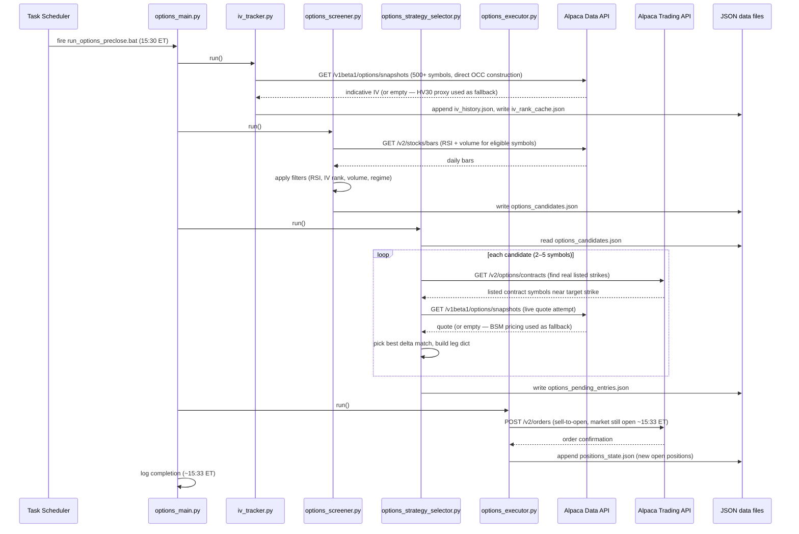
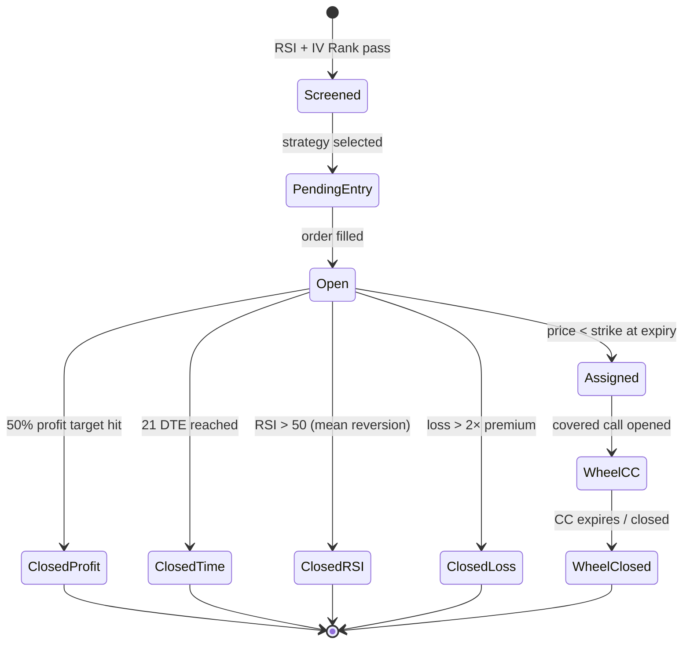

# 6. Runtime View

## 6.1 Pre-close run (15:30 ET) — IV + screening + order placement

Triggered by Task Scheduler at **15:30 ET** while the market is still open.
`run_options_preclose.bat` → `options_main.py --pre-close`



**Runtime characteristics (pre-close):**
- iv_tracker: ~10–12 seconds (500+ symbols)
- options_screener: ~15–20 seconds (RSI bar fetch)
- strategy_selector: ~5 seconds (2–5 candidates × contract lookup + BSM)
- executor: ~2 seconds (limit orders placed while market open)
- Total: ~35–50 seconds; finishes well before 16:00 ET market close

## 6.2 Post-close run (16:30 ET) — EOD monitoring and analysis

Triggered by Task Scheduler at **16:30 ET** after market close.
`run_options_loop.bat` → `options_main.py --post-close`

No orders are placed in this run (market closed). IV tracker, screener, selector,
and executor are all skipped (already ran at 15:30).

```mermaid
sequenceDiagram
    participant TS as Task Scheduler
    participant Main as options_main.py
    participant MON as options_monitor.py
    participant AN as options_signal_analyzer.py
    participant OPT as options_optimizer.py
    participant AlpacaTrade as Alpaca Trading API
    participant Files as JSON data files

    TS->>Main: fire run_options_loop.bat (16:30 ET)
    Note over Main: IV + screener + selector + executor skipped (ran at 15:30)

    Main->>MON: run() — daily close check
    MON->>Files: read positions_state.json
    loop each open position
        MON->>AlpacaTrade: GET /v1beta1/options/snapshots (EOD quote)
        MON->>MON: check profit target / loss limit / DTE / RSI recovery
        opt exit condition met
            MON->>AlpacaTrade: POST /v2/orders (buy-to-close)
            MON->>Files: update positions_state.json
        end
    end

    Main->>AN: run_analyzer()
    AN->>Files: read options_candidates.json, iv_rank_cache.json, positions_state.json
    AN->>AN: score candidates, compute outcome stats
    AN->>Files: write options_signal_quality.json

    Main->>OPT: run_optimizer()
    OPT->>Files: read options_signal_quality.json, options_config.json
    OPT->>OPT: generate insights (auto-apply when n_closed >= 50)
    OPT->>Files: write options_improvement_report.json

    Main->>Main: log completion
```

## 6.3 Error Handling at Runtime

| Failure | Behaviour |
|---------|-----------|
| Wikipedia fetch fails | Log warning, use cached ticker list from previous run |
| Alpaca data API timeout | `safe_get` retries 2× with 2 s gap; logs warning on persistent failure |
| Options snapshot 404 | Ticker skipped; logged; does not crash pipeline |
| IV Rank unavailable (< 30 days) | Ticker excluded from options screening; IV history continues |
| Order 403 (insufficient qty) | Log error; do not retry; investigate state next cycle |
| Gemini 503 (AI report) | Fallback report used; not a pipeline failure |

## 6.4 State Transitions — Position Lifecycle _(Phase 2)_


