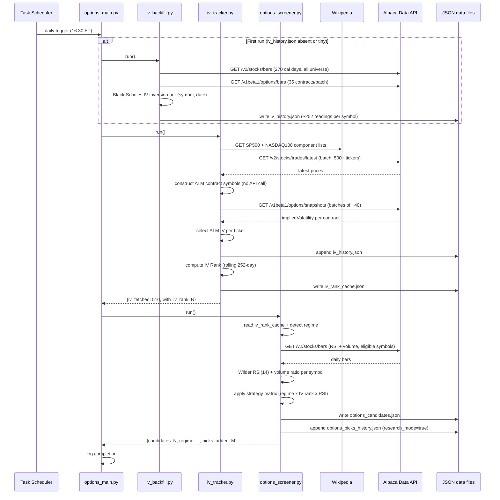
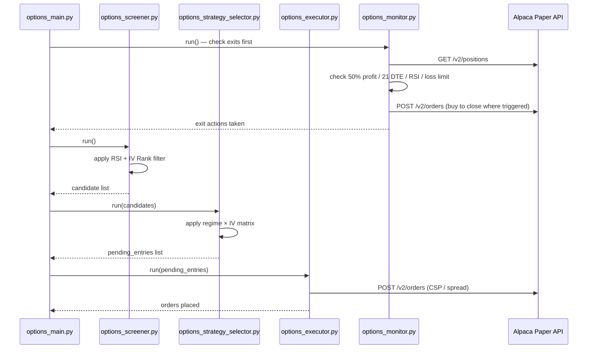
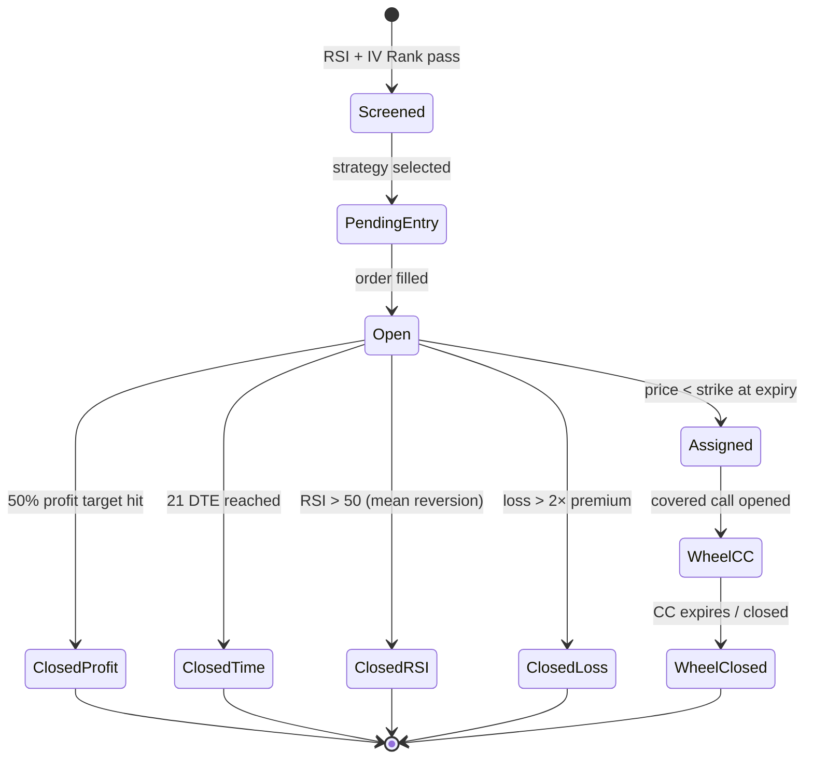

# 6. Runtime View

## 6.1 Daily Pipeline — Phase 1 (Current)

Triggered by Windows Task Scheduler at **16:30 ET** (after market close).

**Runtime characteristics (Phase 1):**
- iv_tracker duration: ~10-12 seconds for 529 universe tickers
- options_screener duration: ~15-20 seconds (RSI bar fetch for eligible symbols)
- iv_backfill (first run only): ~30-60 seconds (~184 API calls)
- No orders placed

## 6.2 Daily Pipeline — Phase 2 (Planned)

## 6.3 Error Handling at Runtime

| Failure | Behaviour |
|---------|-----------|
| Wikipedia fetch fails | Log warning, use cached ticker list from previous run |
| Alpaca data API timeout | `safe_get` retries 2× with 2 s gap; logs warning on persistent failure |
| Options snapshot 404 | Ticker skipped; logged; does not crash pipeline |
| IV Rank unavailable (< 30 days) | Ticker excluded from options screening; IV history continues |
| Order 403 (insufficient qty) | Log error; do not retry; investigate state next cycle |
| Gemini 503 (AI report) | Fallback report used; not a pipeline failure |

## 6.4 State Transitions — Position Lifecycle _(Phase 2)_

