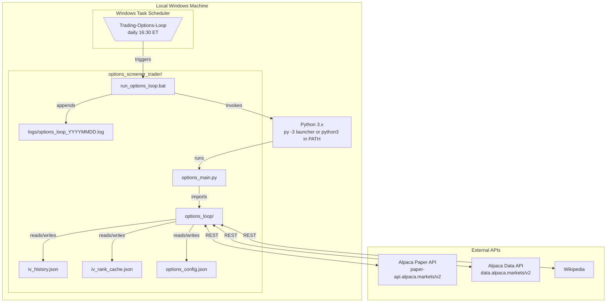

# 7. Deployment View

## 7.1 Infrastructure Overview



## 7.2 Scheduled Tasks

| Task Name | Schedule | Trigger File | Phase |
|-----------|----------|-------------|-------|
| `\Trading-Options-Loop` | Daily 16:30 ET | `run_options_loop.bat` | 1 (live) |
| `\Trading-Options-Monitor-Intraday` | Weekdays 09:30 ET | `run_options_monitor_intraday.bat` | 2 (planned) |
| `\Trading-Options-Monitor` | Daily 15:45 ET | `run_options_monitor.bat` | 2 (planned) |
| `\Trading-Options-Executor` | Mon 09:15 ET | `run_options_executor.bat` | 2 (planned) |

## 7.3 Directory Layout

```
options_screener_trader/
├── alpaca_config.json                  ← paper account credentials
├── options_config.json                 ← strategy parameters
├── options_main.py                     ← daily orchestrator
├── run_options_loop.bat                ← Task Scheduler entry point
│
├── options_loop/
│   ├── __init__.py
│   ├── iv_backfill.py                  ← LIVE (Phase 1 — first-run bootstrap)
│   ├── iv_tracker.py                   ← LIVE (Phase 1 — daily)
│   ├── options_screener.py             ← LIVE (Phase 1 — research mode)
│   ├── options_strategy_selector.py    ← Phase 2
│   ├── options_executor.py             ← Phase 2
│   ├── options_monitor.py              ← Phase 2
│   ├── options_signal_analyzer.py      ← Phase 3
│   └── options_optimizer.py            ← Phase 3
│
├── iv_history.json                     ← grows daily (backfilled on first run)
├── iv_rank_cache.json                  ← refreshed daily
├── options_candidates.json             ← refreshed daily (Phase 1)
├── options_picks_history.json          ← grows daily (research corpus, Phase 1)
├── options_positions_state.json        ← Phase 2 onwards
├── options_pending_entries.json        ← Phase 2 onwards
│
├── logs/
│   └── options_loop_YYYYMMDD.log
│
└── docs/
    └── architecture/
        ├── 01-introduction-and-goals.md
        ├── ...
        ├── 09-decisions.md
        └── adr/
            └── 001-*.md
```

## 7.4 Credentials

- `alpaca_config.json` contains paper account API key and secret
- File is **not committed** to any VCS
- Account type: paper (`https://paper-api.alpaca.markets/v2`)

## 7.5 Logging

Each `run_options_loop.bat` invocation writes a date-stamped log file:

```
[date time] options loop starting
[UTC timestamp] options_main starting
[UTC timestamp] Phase: 1 (IV history + research screener -- no orders)
[UTC timestamp] IV history present -- skipping backfill
[UTC timestamp] Running iv_tracker...
[UTC timestamp]   iv_tracker done: 510 symbols tracked, 487 with full IV rank
[UTC timestamp] Running options_screener (research mode)...
[UTC timestamp]   screener done: 12 candidates, regime=bull, 12 new picks logged
[UTC timestamp] options_main done in 28.3s
[date time] options loop done (exit 0)
```
