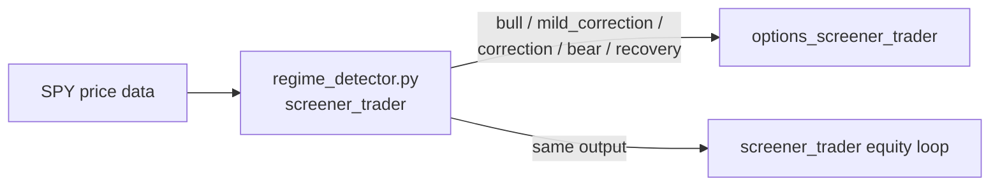
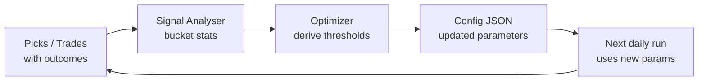

# 8. Cross-cutting Concepts

## 8.1 Market Regime Detection (Shared)

Regime classification is **shared** with screener_trader — the same SPY-based regime
detector is imported directly, not duplicated.



Regimes drive strategy selection:
- **bull / recovery** → CSP is primary
- **mild_correction** → put credit spread or smaller CSP
- **correction** → very selective OTM spreads only
- **bear** → no new positions opened

## 8.2 Self-Improvement Loop Pattern

Both sub-projects follow the same learning pattern:



| Layer | Equity screener | Options screener |
|-------|----------------|-----------------|
| History | `picks_history.json` | `options_picks_history.json` |
| Analyser | `signal_analyzer.py` | `options_signal_analyzer.py` |
| Optimizer | `optimizer.py` | `options_optimizer.py` |
| Config | `screener_config.json` | `options_config.json` |

Key principle: **regime-aware buckets**. Stats are computed per regime first;
only fall back to global stats if regime sample count is insufficient (< 20 samples).

## 8.3 Earnings as Signal (Not Block)

Near-earnings tickers are **flagged**, not excluded.

- `iv_tracker.py` marks `near_earnings: true` in `iv_rank_cache.json`
- The flag is recorded on every `options_picks_history.json` entry
- The optimizer can learn whether earnings proximity helps or hurts yield
- **Hard rule exception:** never sell naked puts on earnings week (IV spike risk)
  but put credit spreads (capped risk) remain eligible

## 8.4 IV Data Self-Sufficiency

No external IV data vendor is required. The system bootstraps its own IV history:

```
Day 1-29:   iv_history.json grows; iv_rank = null (not enough data)
Day 30+:    IV Rank computable; tickers become eligible for options screening
Day 252+:   Full 52-week rank available; most accurate ranking
```

IV is fetched from Alpaca's indicative options snapshot feed.
The correct field is `snap["impliedVolatility"]` (top-level — not inside `greeks`).

## 8.5 API Error Handling

All external API calls follow a consistent pattern:

| HTTP Status | Behaviour |
|-------------|-----------|
| 200 | Parse and use |
| 404 | Return `None` (ticker not found / contract not listed) |
| 403 | Log error with full body; do not retry |
| 5xx / timeout | Retry up to 2× with 2 s gap; log warning on persistent failure |

`safe_get(url, retries=2)` implements this pattern for all GET calls.

## 8.6 State Persistence

All state is **plain JSON files** — no database, no ORM:

| File | Persistence type | Updated |
|------|-----------------|---------|
| `iv_history.json` | Append-only | Daily after market close |
| `iv_rank_cache.json` | Full overwrite | Daily after IV fetch |
| `options_config.json` | Full overwrite | When optimizer updates params |
| `options_picks_history.json` | Append-only | On each new trade entry and exit |
| `options_positions_state.json` | Full overwrite | Each monitor cycle |

## 8.7 Logging Convention

All log lines use UTC timestamps in `[YYYY-MM-DD HH:MM:SS]` format.
Bat files prepend/append `[%date% %time%]` lines for start/end.
Log files are date-stamped: `options_loop_YYYYMMDD.log`.

Severity prefixes used in log lines:
- `[INFO]` — normal operation
- `[WARN]` — recoverable issue (API retry, ticker skipped)
- `[ERROR]` — non-recoverable issue that requires investigation
