# 10. Quality Requirements

## 10.1 Quality Tree

```mermaid
graph TD
    Q[Quality] --> S[Safety]
    Q --> O[Observability]
    Q --> SI[Self-improvement]
    Q --> R[Resilience]
    Q --> Sim[Simplicity]

    S --> S1[No position > 10% NAV]
    S --> S2[Bear regime = zero new trades]
    S --> S3[Never sell naked puts on earnings week]
    S --> S4[Paper account only]

    O --> O1[Every decision logged with reasoning]
    O --> O2[improvement_report.json generated daily]
    O --> O3[iv_rank_cache shows per-ticker state]

    SI --> SI1[Parameters update from trade outcomes]
    SI --> SI2[Regime-aware: bull vs correction separate]
    SI --> SI3[IV rank threshold narrows over time]

    R --> R1[API failure = warning, not crash]
    R --> R2[State survives restarts]
    R --> R3[safe_get retries 2x on timeout]

    Sim --> Sim1[Each module does one thing]
    Sim --> Sim2[Reuse screener_trader components]
    Sim --> Sim3[Plain JSON state, no database]
```

## 10.2 Quality Scenarios

| ID | Quality | Scenario | Measure |
|----|---------|---------|---------|
| QS-01 | Safety | A position moves against us | Loss capped at 2× premium received (~2% NAV) |
| QS-02 | Safety | Bear regime detected | Zero new option positions opened |
| QS-03 | Safety | Single position sizing | Never exceeds 8% of NAV (CSP collateral) |
| QS-04 | Observability | Daily run completes | Log file shows all IV fetches, decisions, errors |
| QS-05 | Observability | Trade entry/exit | Full reasoning (regime, IV rank, RSI, strategy) recorded |
| QS-06 | Self-improvement | 50 closed trades with outcomes | Optimizer produces regime-specific thresholds |
| QS-07 | Self-improvement | IV rank threshold | Expected to narrow to 45–60 range from initial 40 |
| QS-08 | Resilience | Alpaca API timeout | Retry 2× then skip ticker; pipeline continues |
| QS-09 | Resilience | Wikipedia fetch fails | Use previous ticker list from cache |
| QS-10 | Simplicity | New module added | Follows existing pattern; < 200 lines for single-responsibility module |

## 10.3 Target Metrics (12-Month Horizon)

| Metric | Target |
|--------|--------|
| Annualised premium yield on deployed capital | > 15% |
| Win rate (expires worthless or 50% profit close) | > 65% |
| Assignment rate (CSPs that result in stock delivery) | < 20% |
| Average days held per trade | < 25 DTE |
| Consecutive losing weeks before pause trigger | 3 |
