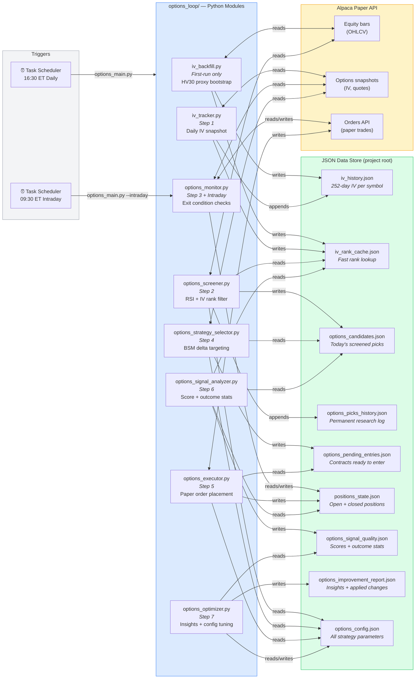

# C4 — Level 2: Containers

The eight Python modules and their relationships to the nine JSON data files.

---

## Container diagram

---

## Module responsibilities at a glance

| Module | Single responsibility | Touches orders? |
|---|---|---|
| `iv_backfill.py` | Bootstrap 252-day IV history on first run | No |
| `iv_tracker.py` | Append today's IV snapshot; recompute ranks | No |
| `options_screener.py` | Filter universe by RSI, IV rank, volume | No |
| `options_monitor.py` | Check exit conditions on open positions | Yes — buy-to-close |
| `options_strategy_selector.py` | Find the right contract for each candidate | No |
| `options_executor.py` | Place paper entry orders | Yes — sell-to-open |
| `options_signal_analyzer.py` | Score candidates; aggregate closed-position stats | No |
| `options_optimizer.py` | Generate insights; optionally tune config | No |

**Safety principle:** Only `options_executor.py` and `options_monitor.py` touch the
Alpaca orders API. All other modules are purely analytical.

---

## Data file ownership

| File | Owner (writes) | Consumers (reads) |
|---|---|---|
| `iv_history.json` | iv_backfill, iv_tracker | iv_tracker |
| `iv_rank_cache.json` | iv_backfill, iv_tracker | screener, analyzer |
| `options_candidates.json` | screener | selector, analyzer |
| `options_picks_history.json` | screener | humans |
| `options_pending_entries.json` | selector | executor |
| `positions_state.json` | executor (create), monitor (update) | monitor, analyzer, optimizer |
| `options_signal_quality.json` | analyzer | optimizer |
| `options_improvement_report.json` | optimizer | humans |
| `options_config.json` | human + optimizer | all modules |
