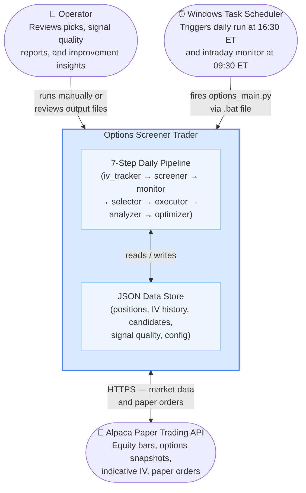

# C4 — Level 1: System Context

Who uses this system and what external systems does it talk to.

> Diagrams use [Mermaid](https://mermaid.js.org/) — renders in GitHub, VS Code, Obsidian, etc.

---

## System context diagram

---

## External actors

### Operator
The human running and monitoring the system. Responsibilities:
- Configures `alpaca_config.json` and `options_config.json`
- Monitors daily output: candidate list, signal scores, positions
- Reviews the improvement report for optimizer suggestions
- Enables `auto_entry` and (eventually) `auto_optimize` when confident

### Windows Task Scheduler
The automation layer. Two scheduled tasks:

| Task | Schedule | Script |
|---|---|---|
| `\Trading-Options-Daily` | 16:30 ET Mon–Fri | `run_options_loop.bat` |
| `\Trading-Options-Intraday` | 09:30 ET Mon–Fri | `run_options_monitor_intraday.bat` |

### Alpaca Paper Trading API
The brokerage interface. Used for:
- Equity historical bars (OHLCV) — for IV proxy and RSI calculation
- Options indicative IV snapshots — for daily IV rank updates
- Options contract quotes — for contract selection validation
- Paper order placement — for simulated trade execution

**Constraint:** OPRA options historical bars are blocked on paper accounts (403).
This is the reason for the HV30 proxy in the IV backfill. See [ADR-008](../architecture/adr/008-hv30-proxy-iv-backfill.md).

---

## What is NOT in scope

- Real money trading (paper account only during this phase)
- Websocket streaming (polling chosen deliberately — see [ADR-006](../architecture/adr/006-intraday-polling-over-websocket.md))
- Web UI or browser dashboard (output is JSON files + console)
- Email/SMS alerts
- Multi-account or multi-strategy orchestration
- Database — all state is in JSON files on disk
