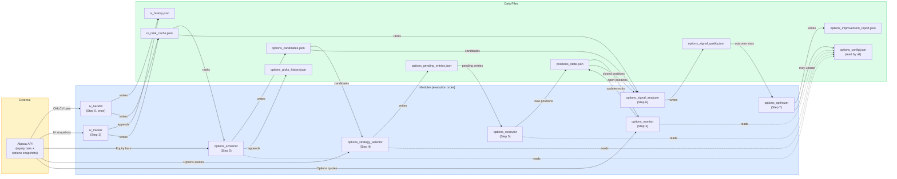

# Data Flow — File Dependencies

Which module produces which file, and which modules consume it.
Useful for understanding the effect of a failure at any step.

---

## Data dependency graph

---

## Failure impact table

What breaks downstream if a given step fails or produces bad output.

| Failed step | Immediate output lost | Downstream impact |
|---|---|---|
| `iv_backfill` | `iv_history.json`, `iv_rank_cache.json` | Screener has no IV ranks → 0 candidates. Mitigated: only runs once. |
| `iv_tracker` | Today's IV rank update | Screener uses yesterday's ranks (slightly stale but still valid). |
| `options_screener` | `options_candidates.json` | Selector and analyzer have no candidates. Monitor still runs and can close positions. |
| `options_monitor` | Exit checks skipped | Open positions not closed on schedule. **Highest impact — positions may exceed loss limit.** |
| `options_strategy_selector` | `options_pending_entries.json` empty | Executor has nothing to enter. Existing positions unaffected. |
| `options_executor` | No new orders placed | No new positions opened. Existing positions unaffected. |
| `options_signal_analyzer` | `options_signal_quality.json` stale | Optimizer uses previous run's stats (slightly stale). No trading impact. |
| `options_optimizer` | `options_improvement_report.json` stale | No config changes applied. No trading impact. |

**Priority order for investigation:** monitor > tracker > screener > selector > executor > analyzer > optimizer.

---

## File regeneration — what's safe to delete

| File | Safe to delete? | Effect |
|---|---|---|
| `iv_history.json` | ⚠️ Only with `--backfill` | Triggers full backfill on next run (~2-5 min) |
| `iv_rank_cache.json` | ✓ Yes | Regenerated by iv_tracker on next run |
| `options_candidates.json` | ✓ Yes | Regenerated by screener on next run |
| `options_picks_history.json` | ❌ No | Permanent log — only append, never delete |
| `options_pending_entries.json` | ✓ Yes | Regenerated by selector on next run |
| `positions_state.json` | ❌ Never | Source of truth for open positions — loss means loss of trade records |
| `options_signal_quality.json` | ✓ Yes | Regenerated by analyzer on next run |
| `options_improvement_report.json` | ⚠️ Careful | Regenerated, but `all_applied_changes` history is lost |
| `options_config.json` | ❌ No | Contains live strategy parameters and optimizer changes |
