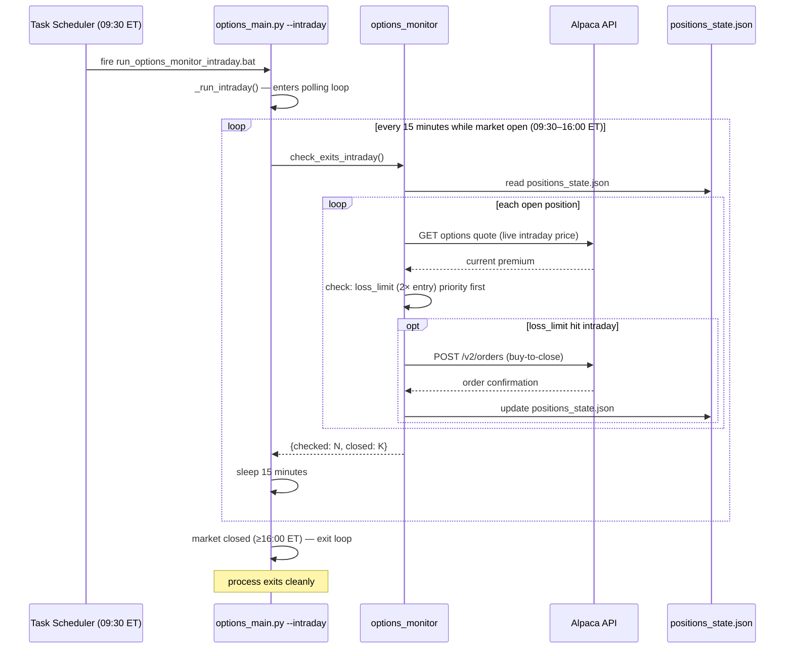
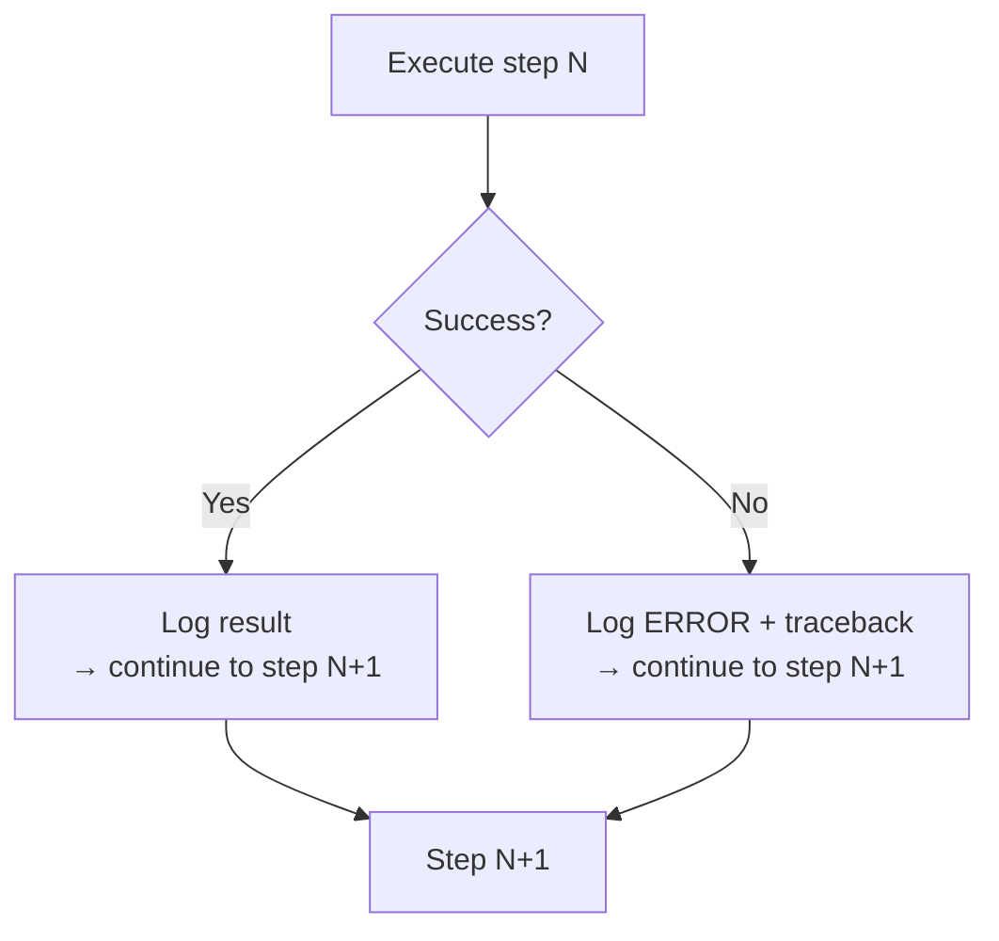

# Runtime View — Daily Pipeline Sequence

How the 7-step daily pipeline executes, including data handoffs and error paths.

---

## Pre-close run (15:30 ET) — IV + screening + order placement

```mermaid
sequenceDiagram
    autonumber
    participant TS as Task Scheduler
    participant M as options_main.py
    participant BF as iv_backfill
    participant IV as iv_tracker
    participant SC as options_screener
    participant SEL as options_strategy_selector
    participant EX as options_executor
    participant ALD as Alpaca Data API
    participant ALT as Alpaca Trading API
    participant FS as JSON Files

    TS->>M: fire run_options_preclose.bat (15:30 ET)
    M->>M: check --backfill flag or iv_history absent?

    alt First run or --backfill
        M->>BF: run_backfill()
        BF->>ALD: GET /v2/stocks/{sym}/bars (252d × 512 symbols)
        ALD-->>BF: equity OHLCV bars
        BF->>BF: compute HV30 proxy IV per symbol
        BF->>FS: write iv_history.json, iv_rank_cache.json
        BF-->>M: {new_readings: 79251, with_iv_rank: 512}
    end

    Note over M,FS: Step 1 — IV Tracker
    M->>IV: run_iv()
    IV->>ALD: GET /v1beta1/options/snapshots (512 symbols, direct OCC construction)
    ALD-->>IV: indicative IV (or empty — HV30 proxy fallback)
    IV->>FS: append iv_history.json, write iv_rank_cache.json
    IV-->>M: {iv_fetched: 512, with_iv_rank: 512}

    Note over M,FS: Step 2 — Screener
    M->>SC: run_screener()
    SC->>FS: read iv_rank_cache.json
    SC->>ALD: GET /v2/stocks/{sym}/bars (RSI + volume)
    ALD-->>SC: equity bars
    SC->>SC: apply filters, detect regime
    SC->>FS: write options_candidates.json, append options_picks_history.json
    SC-->>M: {candidates: 3, regime: "bull"}

    Note over M,FS: Step 4 — Strategy Selector
    M->>SEL: run_selector()
    SEL->>FS: read options_candidates.json
    loop each candidate (2–5 symbols)
        SEL->>ALT: GET /v2/options/contracts (real listed strikes near target)
        ALT-->>SEL: listed OCC symbols
        SEL->>ALD: GET /v1beta1/options/snapshots (live quote attempt)
        ALD-->>SEL: quote or empty
        SEL->>SEL: BSM-price real contracts, pick best delta match
    end
    SEL->>FS: write options_pending_entries.json
    SEL-->>M: {pending: 3}

    Note over M,FS: Step 5 — Executor (market still open ~15:33 ET)
    M->>EX: run_executor()
    EX->>FS: read options_pending_entries.json, options_config.json
    alt auto_entry.enabled = true
        loop each pending entry
            EX->>ALT: POST /v2/orders (sell-to-open limit)
            ALT-->>EX: order id
            EX->>FS: append positions_state.json (new open position)
        end
    end
    EX-->>M: {executed: K, skipped: N-K}

    M->>M: log completion (~15:33 ET)
```

---

## Post-close run (16:30 ET) — EOD monitoring and analysis

No orders placed — options market closed at 16:00 ET.
Steps 1, 2, 4, 5 are skipped (already ran at 15:30).

```mermaid
sequenceDiagram
    autonumber
    participant TS as Task Scheduler
    participant M as options_main.py
    participant MON as options_monitor
    participant AN as options_signal_analyzer
    participant OPT as options_optimizer
    participant ALD as Alpaca Data API
    participant ALT as Alpaca Trading API
    participant FS as JSON Files

    TS->>M: fire run_options_loop.bat (16:30 ET)
    Note over M: Steps 1/2/4/5 skipped (ran at 15:30 ET)

    Note over M,FS: Step 3 — Monitor (daily close check)
    M->>MON: run_monitor()
    MON->>FS: read positions_state.json
    loop each open position
        MON->>ALD: GET /v1beta1/options/snapshots (EOD quote)
        ALD-->>MON: current premium
        MON->>MON: check: profit target / loss limit / DTE / RSI recovery
        opt exit condition met
            MON->>ALT: POST /v2/orders (buy-to-close)
            ALT-->>MON: order confirmation
            MON->>FS: update positions_state.json (mark closed)
        end
    end
    MON-->>M: {checked: N, closed: K}

    Note over M,FS: Step 6 — Signal Analyzer
    M->>AN: run_analyzer()
    AN->>FS: read options_candidates.json, iv_rank_cache.json, positions_state.json
    AN->>AN: score candidates, analyze closed positions
    AN->>FS: write options_signal_quality.json
    AN-->>M: {n_candidates_scored: 3, sell_zone_pct: 68}

    Note over M,FS: Step 7 — Optimizer
    M->>OPT: run_optimizer()
    OPT->>FS: read options_signal_quality.json, options_config.json
    OPT->>OPT: generate_insights()
    alt n_closed >= 50 AND auto_optimize=true
        OPT->>FS: write options_config.json (updated params)
    end
    OPT->>FS: write options_improvement_report.json
    OPT-->>M: {n_closed: 0, n_insights: 0, n_applied: 0}

    M->>M: log total elapsed time
```

---

## Intraday monitor sequence (09:30–16:00 ET)



---

## Error handling in the pipeline

Every step is wrapped in `try/except` in `options_main.py`. The pipeline never aborts
mid-run due to a single step failing.



This means:
- A failed screener still allows the monitor to close existing positions.
- A failed executor still allows the analyzer to run.
- Any step can be fixed and re-run standalone using its `if __name__ == '__main__':` block.
