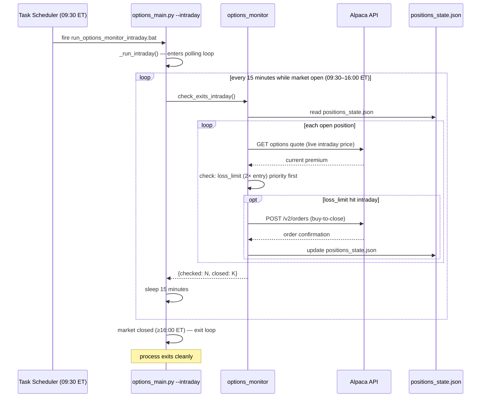
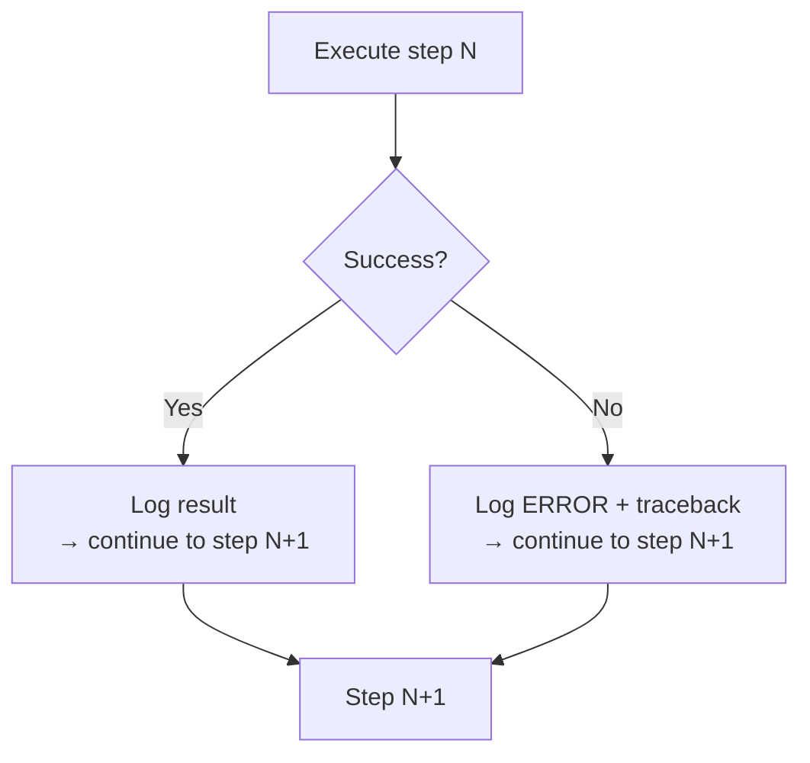

# Runtime View — Daily Pipeline Sequence

How the 7-step daily pipeline executes, including data handoffs and error paths.

---

## Full daily run sequence (16:30 ET)

```mermaid
sequenceDiagram
    autonumber
    participant TS as Task Scheduler
    participant M as options_main.py
    participant BF as iv_backfill
    participant IV as iv_tracker
    participant SC as options_screener
    participant MON as options_monitor
    participant SEL as options_strategy_selector
    participant EX as options_executor
    participant AN as options_signal_analyzer
    participant OPT as options_optimizer
    participant AL as Alpaca API
    participant FS as JSON Files

    TS->>M: fire run_options_loop.bat (16:30 ET)
    M->>M: check --backfill flag or iv_history absent?

    alt First run or --backfill
        M->>BF: run_backfill()
        BF->>AL: GET /v2/stocks/{sym}/bars (252d × 512 symbols)
        AL-->>BF: equity OHLCV bars
        BF->>BF: compute HV30 proxy IV per symbol
        BF->>FS: write iv_history.json (79k entries)
        BF->>FS: write iv_rank_cache.json
        BF-->>M: {new_readings: 79251, with_iv_rank: 512}
    end

    Note over M,FS: Step 1 — IV Tracker
    M->>IV: run_iv()
    IV->>AL: GET /v1beta1/options/snapshots/{sym} (512 symbols)
    AL-->>IV: indicative IV per symbol
    IV->>FS: append iv_history.json (1 date × 512 symbols)
    IV->>FS: write iv_rank_cache.json (recomputed ranks)
    IV-->>M: {iv_fetched: 512, with_iv_rank: 512}

    Note over M,FS: Step 2 — Screener
    M->>SC: run_screener()
    SC->>FS: read iv_rank_cache.json
    SC->>AL: GET /v2/stocks/{sym}/bars (RSI + volume, ~30 bars each)
    AL-->>SC: recent equity bars
    SC->>SC: compute RSI, volume ratio, apply filters, detect regime
    SC->>FS: write options_candidates.json
    SC->>FS: append options_picks_history.json
    SC-->>M: {candidates: 5, regime: "bull", picks_added: 5}

    Note over M,FS: Step 3 — Monitor (daily close check)
    M->>MON: run_monitor()
    MON->>FS: read positions_state.json
    loop each open position
        MON->>AL: GET /v1beta1/options/snapshots (current quote)
        AL-->>MON: current premium
        MON->>MON: check: profit target / loss limit / DTE / RSI recovery
        opt exit condition met
            MON->>AL: POST /v2/orders (buy-to-close limit)
            AL-->>MON: order confirmation
            MON->>FS: update positions_state.json (mark closed)
        end
    end
    MON-->>M: {checked: N, closed: K}

    Note over M,FS: Step 4 — Strategy Selector
    M->>SEL: run_selector()
    SEL->>FS: read options_candidates.json
    loop each candidate
        SEL->>SEL: BSM delta targeting → pick strike + expiry
        SEL->>AL: GET /v1beta1/options/snapshots (validate OI, spread)
        AL-->>SEL: contract quote
        SEL->>SEL: validate min OI=500, spread ≤ 15%
    end
    SEL->>FS: write options_pending_entries.json
    SEL-->>M: {pending: N}

    Note over M,FS: Step 5 — Executor
    M->>EX: run_executor()
    EX->>FS: read options_pending_entries.json
    EX->>FS: read options_config.json (auto_entry.enabled?)
    alt auto_entry.enabled = true
        loop each pending entry (up to max_positions gap)
            EX->>AL: POST /v2/orders (sell-to-open limit)
            AL-->>EX: order id
            EX->>FS: append positions_state.json (new open position)
        end
    else auto_entry.enabled = false
        EX-->>M: {executed: 0, skipped: N} (dry run)
    end
    EX-->>M: {executed: K, skipped: N-K}

    Note over M,FS: Step 6 — Signal Analyzer
    M->>AN: run_analyzer()
    AN->>FS: read options_candidates.json
    AN->>FS: read iv_rank_cache.json
    AN->>FS: read positions_state.json
    AN->>AN: score candidates (signal_strength + BSM yield estimate)
    AN->>AN: analyze closed positions (win rate, P&L, hold days)
    AN->>AN: compute IV rank distribution
    AN->>FS: write options_signal_quality.json
    AN-->>M: {n_candidates_scored: 5, sell_zone_pct: 68, data_quality: "hv30_proxy+3d_real"}

    Note over M,FS: Step 7 — Optimizer
    M->>OPT: run_optimizer()
    OPT->>FS: read options_signal_quality.json
    OPT->>FS: read options_config.json
    OPT->>OPT: generate_insights() — compare stats vs rules
    alt n_closed >= 50 AND auto_optimize=true
        OPT->>OPT: apply_insights() — high-confidence changes only
        OPT->>FS: write options_config.json (updated params)
    end
    OPT->>FS: write options_improvement_report.json
    OPT-->>M: {n_closed: 0, n_insights: 0, n_applied: 0}

    M->>M: log total elapsed time
```

---

## Intraday monitor sequence (09:30–16:00 ET)



---

## Error handling in the pipeline

Every step is wrapped in `try/except` in `options_main.py`. The pipeline never aborts
mid-run due to a single step failing.



This means:
- A failed screener still allows the monitor to close existing positions.
- A failed executor still allows the analyzer to run.
- Any step can be fixed and re-run standalone using its `if __name__ == '__main__':` block.
