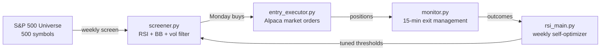

# 1. Introduction and Goals

## 1.1 What We Are Building

**Screener Trader** is a fully automated, self-improving equity trading system that
identifies S&P 500 stocks in severe short-term oversold conditions and captures the
mean-reversion bounce back to neutrality.

The system runs on a Windows machine via Task Scheduler. It screens the full S&P 500
universe every Monday morning, automatically enters positions at market open, monitors
them every 15 minutes throughout market hours, and exits when mean reversion is complete
(RSI recovers to 50) or when stops are hit. A weekly self-optimizing loop (the RSI loop)
analyses historical signal quality and auto-tunes entry thresholds using Gemini AI.

All execution is against an **Alpaca paper trading account** — no real capital is at risk.

---

## 1.2 Goals

| # | Goal |
|---|------|
| G1 | Screen the full S&P 500 weekly and surface stocks with RSI < threshold, price below lower Bollinger Band, and confirmed volume spike |
| G2 | Enter positions automatically Monday morning via Alpaca market orders, with human veto window before 09:15 ET |
| G3 | Protect capital with hard stops (−10%), trailing stops (activating at +10%), and add-down ladders to manage deeper dips |
| G4 | Exit cleanly when mean reversion is complete: RSI ≥ 50, trailing stop hit, or hard stop hit |
| G5 | Self-optimise entry thresholds weekly based on 1,332+ tracked historical picks |
| G6 | Layer in qualitative AI judgement (Gemini) to filter out fundamental deterioration from technical panic |
| G7 | Never deploy real capital — paper trading only |

---

## 1.3 Stakeholders

| Stakeholder | Role | Concern |
|-------------|------|---------|
| Hilary (owner/trader) | Sole user and decision-maker | P&L, risk control, strategy correctness |
| Alpaca Paper API | Broker / execution venue | Order acceptance, position data accuracy |
| Gemini API | AI research layer | Qualitative candidate ranking, weekly report generation |
| Windows Task Scheduler | Automation host | Reliable task firing; log capture |

---

## 1.4 Top Quality Goals

| Priority | Quality Goal | Scenario |
|----------|-------------|---------|
| 1 | **Safety** | Hard stop always live in Alpaca; no position left unprotected; ladder reduces average cost on deep dips |
| 2 | **Reliability** | Scheduler tasks fire correctly Mon–Fri; monitor never misses a 15-min cycle during market hours |
| 3 | **Self-improvement** | Entry thresholds tighten as pick history grows; system becomes data-driven (≥ 10 samples: data-driven mode active with 1,332 picks) |
| 4 | **Observability** | Every screener run, entry, exit, and config change is logged with date-stamped log files |
| 5 | **Human override** | Trader can veto any pending entry by editing `pending_entries.json` before 09:15 ET on Monday |
