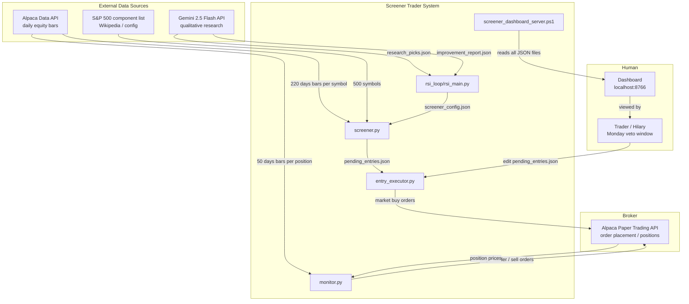

# 3. Context and Scope

## 3.1 System Context Diagram

---

## 3.2 External Interfaces

| Interface | Direction | Protocol | Notes |
|-----------|-----------|----------|-------|
| Alpaca Data API | Inbound | HTTPS REST | Batch equity bars; 30 symbols/call; free-tier rate limits apply |
| Alpaca Paper Trading API | Outbound | HTTPS REST | Market/stop/limit orders; position queries |
| Gemini 2.5 Flash API | Outbound | HTTPS REST | Qualitative candidate ranking; improvement report generation |
| Windows Task Scheduler | Control | OS scheduler | Fires `.bat` scripts at configured times |
| `pending_entries.json` | Human interface | JSON file edit | Trader sets `skip: true` to veto any pick before 09:15 ET |
| Dashboard (localhost:8766) | Outbound | HTTP | Read-only view of all system state; serves JSON data to browser |

---

## 3.3 What Is In Scope

- Screening the full S&P 500 universe weekly using technical filters (RSI, Bollinger Band, volume)
- Placing Alpaca paper market buy orders on Monday mornings
- Managing all open positions: hard stops, trailing stops, add-down ladders, RSI exits
- Weekly self-optimization of entry thresholds from signal quality data
- AI-assisted qualitative research layer (Gemini) to filter oversold candidates
- Local dashboard for observability of all system state
- Regime detection (bull / correction / recovery / bear) to adjust optimizer aggressiveness

## 3.4 What Is Out of Scope

- Live (real money) trading
- Options, futures, or any non-equity instruments
- Intraday screening or intraday entries (entries are once per week at market open)
- External database or cloud hosting
- Multi-account or multi-user support
- Short selling or leveraged positions
- Automated strategy review / CI testing pipeline
