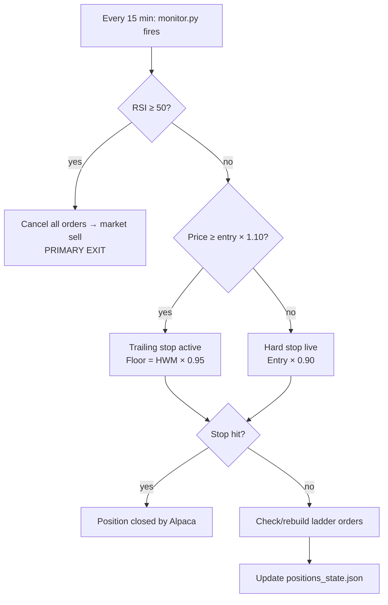
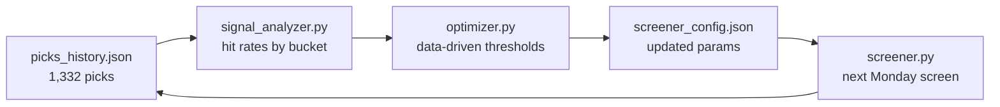

# 4. Solution Strategy

## 4.1 Core Thesis

S&P 500 stocks that become severely oversold — RSI < 20, price below the lower Bollinger
Band (2σ below the 20-period mean), on elevated volume — exhibit a statistically reliable
tendency to snap back toward their mean. The strategy does not predict market direction.
It waits for the setup, enters mechanically, and exits when the reversion is complete.

**Key empirical support (1,332 tracked picks, April 2024 – April 2026):**
- Overall 5-day hit rate: ~60%; average 5-day return: +1.04%
- Correction regime: 86% hit rate, +4.58% average 5-day return
- RSI < 20 significantly outperforms RSI 20–35
- Stocks below the 200-day MA outperform those above (+1.20% vs +0.49% avg 5d return)

---

## 4.2 Entry Strategy

All four filters must pass for a stock to be included in `pending_entries.json`:

| Filter | Default | Rationale |
|--------|---------|-----------|
| RSI(14) < threshold | 20 | Severely oversold — not just weak |
| Price below lower BB(20, 2σ) | required | Statistically extended below mean |
| Volume > N × 20-day avg | 2.0× | Confirms panic/forced selling, not drift |
| Price > 200-day MA | disabled | Removed by optimizer — below 200MA outperforms |

Thresholds are auto-tuned weekly by the optimizer. Currently in data-driven mode (1,332 picks).

---

## 4.3 Exit Strategy

Exits are checked in priority order every 15 minutes during market hours by `monitor.py`.

| Exit Type | Trigger | Action | Priority |
|-----------|---------|--------|---------|
| RSI recovery | RSI(14) ≥ 50 | Cancel all orders → market sell | 1 (primary) |
| Trailing stop | Price ≥ entry × 1.10; floor = HWM × 0.95 | Auto-adjusting stop order in Alpaca | 2 |
| Hard stop | Price ≤ entry × 0.90 | Stop order always live before trailing activates | 3 |

---

## 4.4 Add-Down Ladder (Position Sizing on Dips)

Four limit buy orders are placed below entry at position open:

| Rung | Drop from Entry | Share Multiplier | Rationale |
|------|----------------|-----------------|-----------|
| 1 | −15% | 1.5× | Mild extension — small add |
| 2 | −25% | 2.5× | Moderate dip — meaningful add |
| 3 | −35% | 3.5× | Deep oversold — large add |
| 4 | −45% | 2.0× | Extreme dip — reduce size (tail risk) |

Ladder orders lower the average cost if the stock continues falling, increasing the P&L
of the eventual bounce. If the stock bounces immediately, ladder orders never fill.

---

## 4.5 Self-Optimising Loop

Every Monday at 07:00, `rsi_main.py` runs an 8-step pipeline:

1. **Regime detection** — classifies current market (bull / correction / recovery / bear)
2. **Fill missing returns** — fetches forward returns for all unresolved picks
3. **Signal quality analysis** — hit rates by RSI bucket, volume bucket, regime, 200MA position
4. **Optimizer** — selects thresholds that maximise 5-day forward return hit rate
5. **Research layer** — scans 124 watchlist symbols, sends top 15 to Gemini for qualitative ranking
6. **Screener** (optional, can skip with `--no-screener`)
7. **Log picks** — records both mechanical and AI-ranked picks for future analysis
8. **Report** — Gemini generates a plain-English improvement report

**Mode switch:** < 10 samples → regime defaults; ≥ 10 samples → data-driven optimisation.

---

## 4.6 Regime-Aware Behaviour

The optimizer uses market regime to tune aggressiveness of entry thresholds:

| Regime | 5d Hit Rate | Avg 5d Return | Behaviour |
|--------|------------|---------------|-----------|
| `correction` | 86% | +4.58% | Most aggressive — strategy excels here |
| `recovery` | 78% | +3.18% | Aggressive |
| `mild_correction` | 66% | +0.95% | Moderate |
| `bull` | 53% | +0.21% | Conservative — oversold in bull often = weak stock |
| `bear` | — | — | Very conservative; no data yet |

---

## 4.7 Gemini Research Layer

A qualitative layer on top of the mechanical screener. Gemini 2.5 Flash reviews all
oversold candidates and filters out:

- Stocks with pending binary events (earnings, FDA decisions, legal rulings)
- Fundamental deterioration vs temporary panic (guidance cut, earnings miss trend)
- Very high short interest (short squeeze distortion of RSI reading)

The research layer supplements but does not replace the mechanical screen. Both sets of
picks are logged separately in `picks_history.json` for future signal quality comparison.
