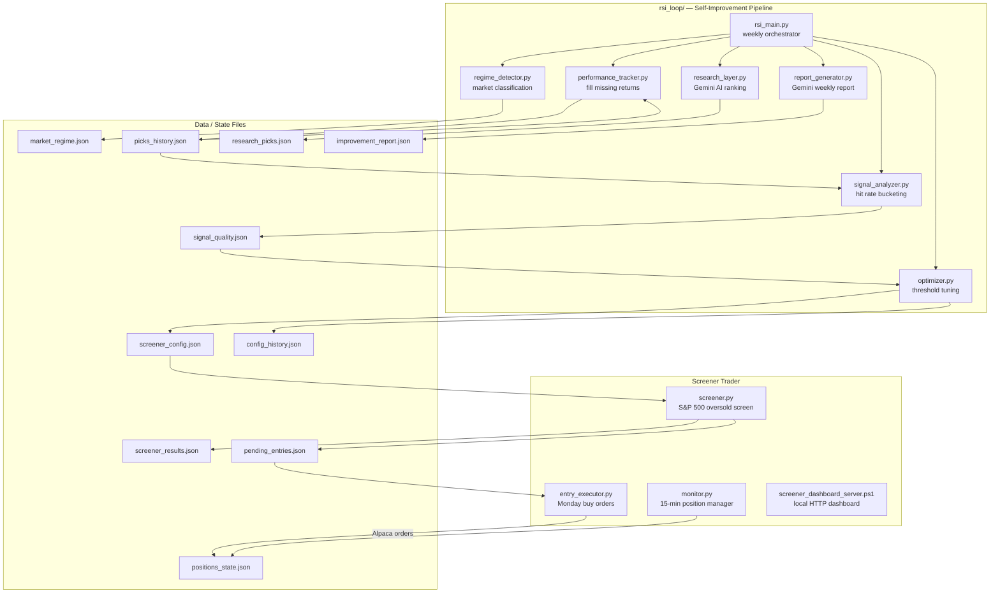

# 5. Building Block View

## 5.1 Level 1 — Top-Level Decomposition



---

## 5.2 Module Responsibilities

### `screener.py` — Weekly Oversold Screen

| Responsibility | Detail |
|----------------|--------|
| Universe | Full S&P 500 (500 symbols), sourced from config |
| Data fetch | 220 days of daily bars; batched 30 symbols per Alpaca API call (~17 calls) |
| Indicators | RSI(14) Wilder, Bollinger Band(20, 2σ), 200-day MA, 20-day volume average |
| Filter | 4 configurable conditions from `screener_config.json`; all must pass |
| Output | `screener_results.json` (top picks) + radar section (2–3 filters) |
| Buy queue | Writes `pending_entries.json` with planned share quantities |
| Speed | ~20× faster than one-call-per-symbol due to batch endpoint |

**Key design:** The Alpaca multi-symbol batch endpoint fetches 30 symbols per API call,
enabling the full 500-symbol screen in ~17 calls rather than 500.

---

### `entry_executor.py` — Monday Buy Order Placer

| Responsibility | Detail |
|----------------|--------|
| Timing | Runs at 09:15 ET — 15 minutes before market open; orders queue and fill at 09:30 |
| Input | `pending_entries.json`; only processes entries with `status: "pending"` |
| Deduplication | Skips any symbol already held in Alpaca or in `positions_state.json` |
| Human veto | Respects `skip: true` flag — trader can veto any pick before 09:15 |
| Output | Alpaca market buy orders; sets `status: "executed"` in file |

---

### `monitor.py` — 15-Minute Position Manager

| Responsibility | Detail |
|----------------|--------|
| Frequency | Every 15 min, Mon–Fri, 09:25–16:05 ET |
| RSI exit | Fetches 50 daily bars per position; if RSI ≥ 50: cancel all orders → market sell |
| High water mark | Tracks peak price per position for trailing stop floor calculation |
| Trailing stop | Activates at +10%; floor = HWM × 0.95; raises only, never falls |
| Hard stop | Fixed at entry × 0.90; re-placed automatically if cancelled or filled |
| Ladder orders | Maintains 4 limit buy rungs; rebuilds if missing or filled |
| State | Reads/writes `positions_state.json`; auto-initialises new Alpaca positions |

**Stop replacement timing:** Cancel old stop → wait 0.5s → place new stop (prevents 403 race condition).

---

### `rsi_loop/rsi_main.py` — Weekly Self-Improvement Orchestrator

8-step pipeline run every Monday at 07:00 (after screener, before executor):

| Step | Module | Output |
|------|--------|--------|
| 1 | `regime_detector.py` | `market_regime.json` |
| 2 | `performance_tracker.py` | Updates `picks_history.json` with forward returns |
| 3 | `signal_analyzer.py` | `signal_quality.json` |
| 4 | `optimizer.py` | Updates `screener_config.json`, appends `config_history.json` |
| 5 | `research_layer.py` | `research_picks.json` |
| 6 | `screener.py` | (optional, skip with `--no-screener`) |
| 7 | performance_tracker | Logs new picks to `picks_history.json` |
| 8 | `report_generator.py` | `improvement_report.json` |

---

### `rsi_loop/regime_detector.py` — Market Classifier

Classifies current market using SPY + VIXY metrics into one of:
`bull` / `mild_correction` / `correction` / `recovery` / `geopolitical_shock` / `bear`

Shared: also imported directly by `options_screener_trader`.

---

### `rsi_loop/signal_analyzer.py` — Hit Rate Bucketing

Reads `picks_history.json` and computes performance statistics bucketed by:
- `by_regime` — which market regime was active at entry
- `by_rsi_bucket` — RSI < 15, 15–20, 20–25, etc.
- `by_vol_bucket` — volume ratio bands
- `by_ma200_bucket` — above vs below 200-day MA

---

### `rsi_loop/optimizer.py` — Threshold Tuner

- < 10 samples: applies regime-based default thresholds
- ≥ 10 samples: data-driven — finds RSI/volume/MA thresholds that maximise 5-day return hit rate
- Currently: 1,332 samples, data-driven mode active
- Writes updated parameters to `screener_config.json`; records change in `config_history.json`

---

### `rsi_loop/research_layer.py` — Gemini AI Ranking

- Scans 124 watchlist symbols for RSI < 40
- Sends top 15 candidates to Gemini 2.5 Flash
- Gemini ranks by: news catalyst awareness, balance sheet quality, binary event risk
- Output: `research_picks.json`

---

### `screener_dashboard_server.ps1` — Local Observability Dashboard

- Serves `http://localhost:8766/`
- Reads all JSON data files and renders live views
- Panels: screener results, radar, pending entries, market regime, config history, research picks, performance tracker, RSI loop logs
- Interactive: "Run Screener" and "Run RSI Loop" buttons

---

## 5.3 Data Flow Summary

```
Monday 06:00
  screener.py → screener_results.json + pending_entries.json

Monday 07:00
  rsi_main.py →
    regime_detector.py    → market_regime.json
    performance_tracker   → picks_history.json (returns filled)
    signal_analyzer.py    → signal_quality.json
    optimizer.py          → screener_config.json, config_history.json
    research_layer.py     → research_picks.json
    report_generator.py   → improvement_report.json

Monday 09:15
  entry_executor.py → Alpaca buy orders

Mon–Fri 09:25–16:05, every 15 min
  monitor.py → positions_state.json, Alpaca stop/ladder/sell orders
```
