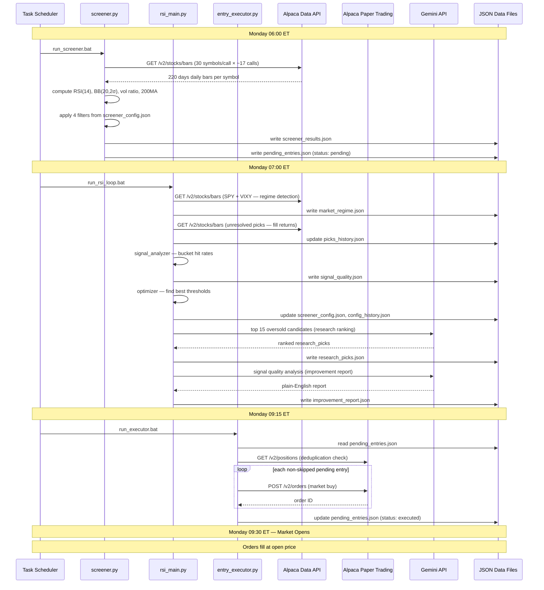
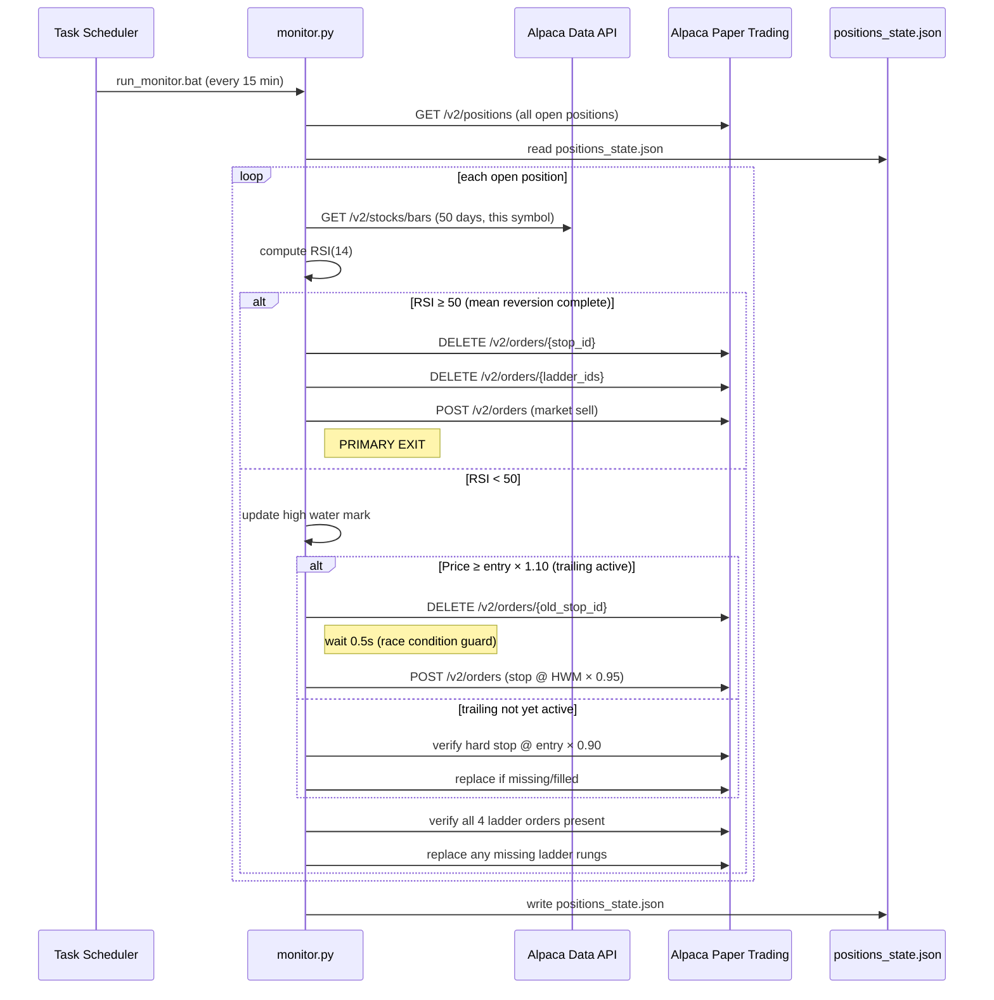
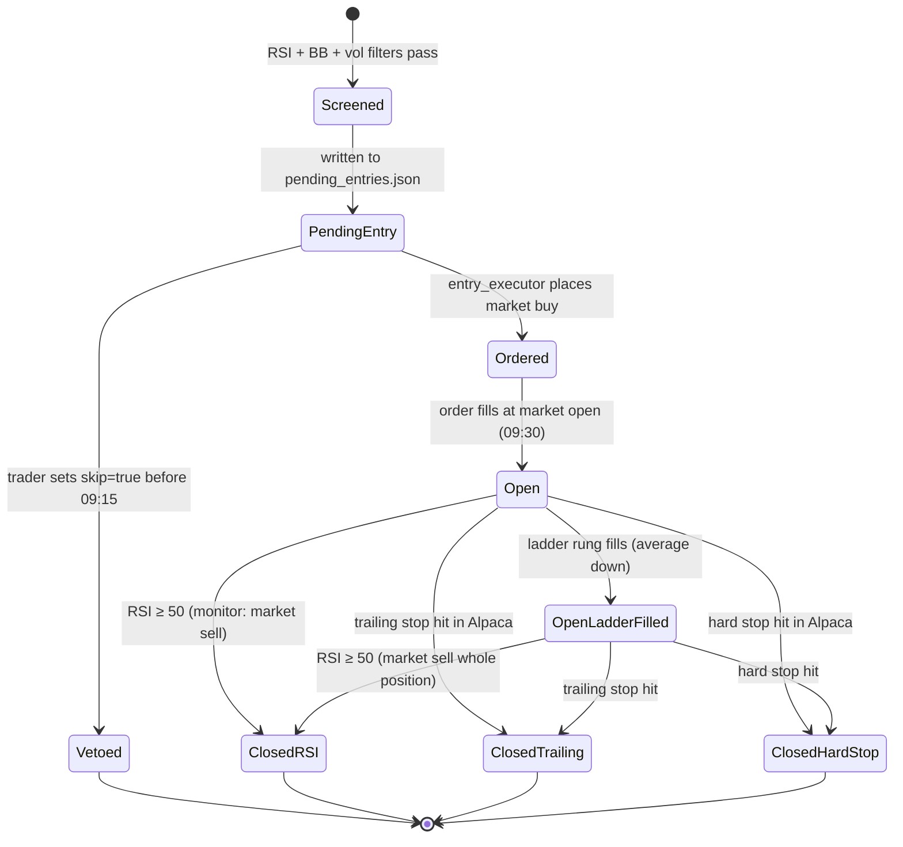

# 6. Runtime View

## 6.1 Monday Morning Pipeline

---

## 6.2 Intraday Monitor Cycle (Every 15 Min, 09:25–16:05)

---

## 6.3 Position Lifecycle State Machine

---

## 6.4 Error Handling at Runtime

| Failure | Behaviour |
|---------|-----------|
| Alpaca data API timeout | Screener logs warning and skips the failed batch; partial results still written |
| Alpaca trading API 403 on stop replace | wait 0.5s then retry once; logged if second attempt fails |
| Gemini API 503 / timeout | Research layer logs warning; `research_picks.json` not updated this cycle; not a pipeline failure |
| `pending_entries.json` missing | Entry executor logs error and exits cleanly; no orders placed |
| `positions_state.json` missing | Monitor auto-initialises empty state; all Alpaca positions treated as new |
| New Alpaca position not in state | Monitor auto-initialises with entry price from Alpaca; places hard stop and ladder orders on first cycle |
| Scheduler misfire (sleep / reboot) | Date-stamped logs make missed runs detectable; manual re-run via `.bat` files |
| RSI computation with < 220 bars | Symbol skipped by screener; logged |
