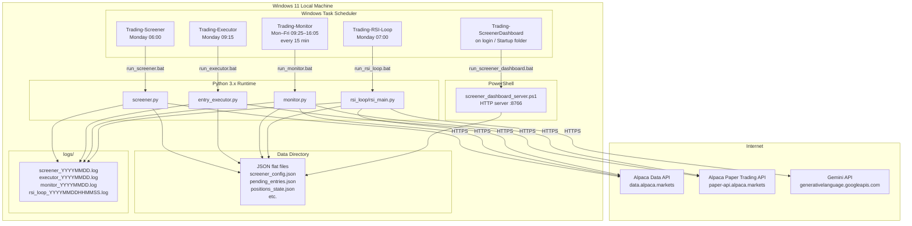

# 7. Deployment View

## 7.1 Infrastructure Overview

The entire system runs on a single Windows machine. There is no cloud component,
no container, and no remote server. All scheduled tasks are managed by Windows Task Scheduler.



---

## 7.2 Task Scheduler Configuration

| Task Name | Trigger | Script | Action |
|-----------|---------|--------|--------|
| `Trading-Screener` | Weekly, Monday 06:00 local | `run_screener.bat` | `py -3 screener.py` |
| `Trading-RSI-Loop` | Weekly, Monday 07:00 local | `run_rsi_loop.bat` | `py -3 rsi_loop\rsi_main.py` |
| `Trading-Executor` | Weekly, Monday 09:15 local | `run_executor.bat` | `py -3 entry_executor.py` |
| `Trading-Monitor` | Daily, Mon–Fri 09:25–16:05, repeat every 15 min | `run_monitor.bat` | `py -3 monitor.py` |
| `Trading-ScreenerDashboard` | At logon (Startup folder shortcut) | `run_screener_dashboard.bat` | PowerShell dashboard server |

All `.bat` files activate the project Python virtual environment before calling the script.
All tasks log to `logs\` with date-stamped filenames.

---

## 7.3 Directory Layout

```
screener_trader\
├── screener.py                    # Weekly screener
├── entry_executor.py              # Monday buy executor
├── monitor.py                     # 15-min position monitor
├── screener_dashboard_server.ps1  # Local HTTP dashboard
│
├── rsi_loop\
│   ├── rsi_main.py                # RSI loop orchestrator
│   ├── regime_detector.py         # Market regime classifier
│   ├── performance_tracker.py     # Fill forward returns
│   ├── signal_analyzer.py         # Hit rate bucketing
│   ├── optimizer.py               # Threshold tuner
│   ├── research_layer.py          # Gemini AI ranker
│   └── report_generator.py        # Gemini report writer
│
├── run_screener.bat
├── run_rsi_loop.bat
├── run_executor.bat
├── run_monitor.bat
├── run_screener_dashboard.bat
│
├── screener_config.json           # Live strategy parameters (auto-updated)
├── screener_results.json          # Latest screener output
├── pending_entries.json           # Monday buy queue (human-editable)
├── positions_state.json           # Per-position monitor state
├── market_regime.json             # Current regime classification
├── signal_quality.json            # Historical hit-rate buckets
├── picks_history.json             # All picks + forward returns
├── research_picks.json            # Gemini AI ranked candidates
├── improvement_report.json        # Weekly Gemini report
├── config_history.json            # Config change log
│
├── logs\
│   ├── screener_YYYYMMDD.log
│   ├── executor_YYYYMMDD.log
│   ├── monitor_YYYYMMDD.log
│   └── rsi_loop_YYYYMMDDHHMMSS.log
│
└── docs\
    ├── architecture.md            # (legacy — superseded by docs/architecture/)
    ├── strategy.md
    ├── runbook.md
    ├── data-schemas.md
    ├── scheduled_tasks.md
    └── architecture\              # arc42 documentation (this tree)
        ├── README.md
        ├── 01-introduction-and-goals.md
        └── ...
```

---

## 7.4 Monday Execution Timeline

```
06:00  Trading-Screener fires     → screener.py scans S&P 500
                                    writes screener_results.json
                                    writes pending_entries.json (status: pending)

07:00  Trading-RSI-Loop fires     → rsi_main.py runs 8-step pipeline
                                    tunes screener_config.json
                                    writes research_picks.json
                                    writes improvement_report.json

[07:00–09:15]  Human review window
                                    Trader can edit pending_entries.json
                                    Set skip: true to veto any pick

09:15  Trading-Executor fires     → entry_executor.py places market buys
                                    updates pending_entries.json (status: executed)

09:25  Trading-Monitor starts     → monitor.py runs every 15 min
09:30  Market opens               → queued orders fill at open price
16:00  Market closes
16:05  Last monitor run
```

---

## 7.5 Dashboard

- **URL:** `http://localhost:8766/`
- **Start:** `powershell -ExecutionPolicy Bypass -File screener_dashboard_server.ps1`
- **Auto-start:** Windows Startup folder shortcut fires `run_screener_dashboard.bat` on login
- **Panels:** screener results, radar, pending entries, market regime, config evolution, research picks, performance tracker (all 1,332 picks), RSI loop logs, screener logs
- **Interactive buttons:** "Run Screener" / "Run RSI Loop" (useful for manual mid-week runs)
